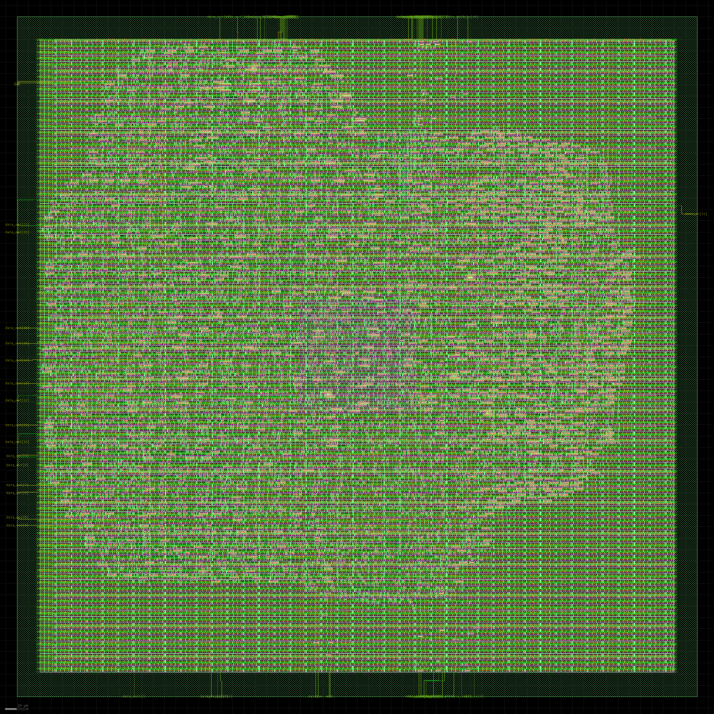
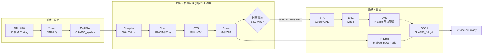
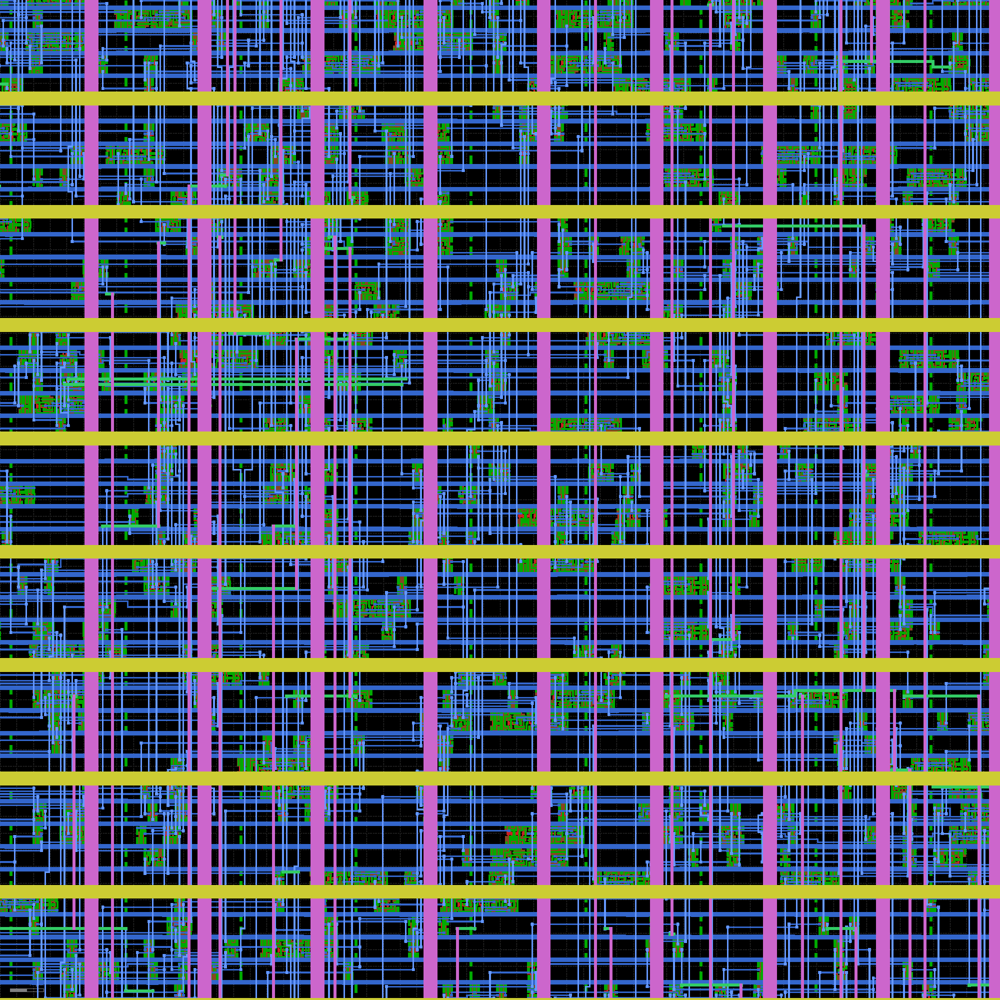
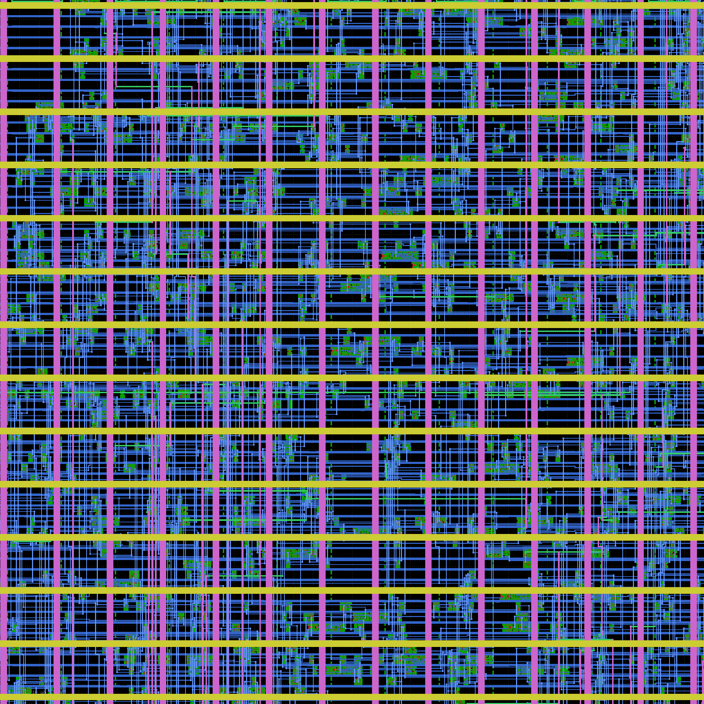
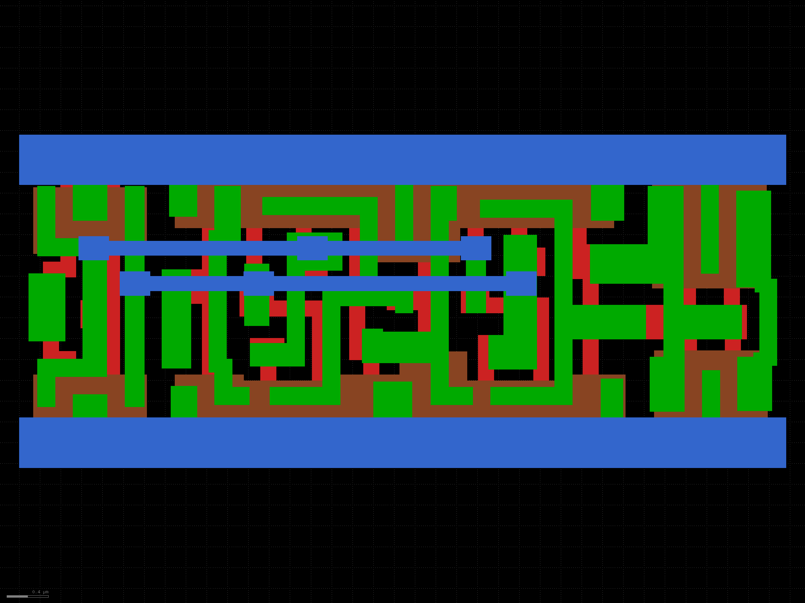
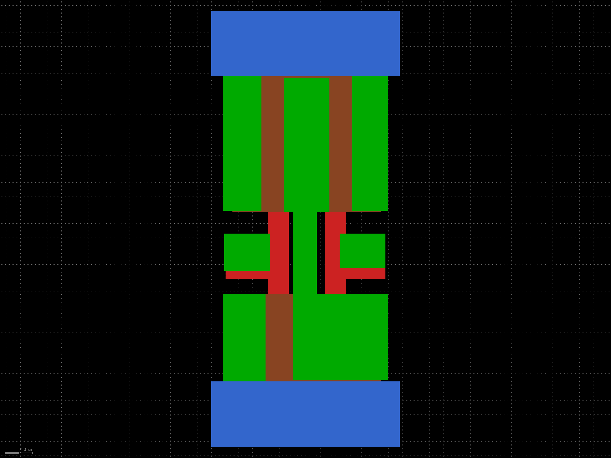
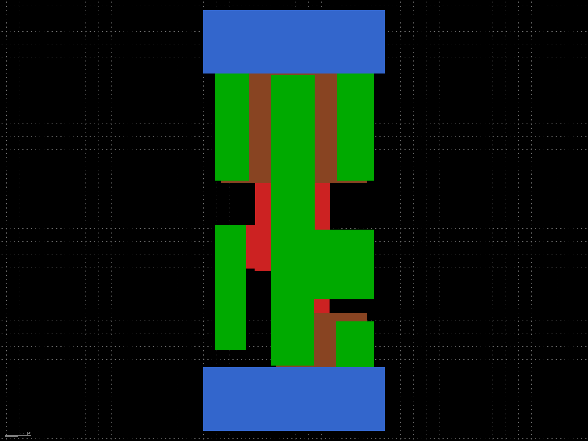
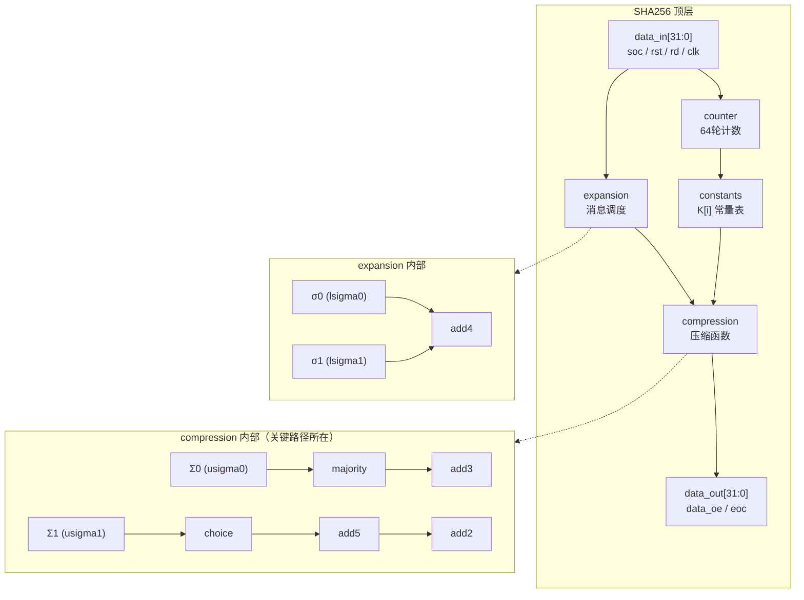

# SHA-256 ASIC — OpenROAD 全流程设计与签核

基于 SkyWater sky130A 130nm 工艺的 SHA-256 密码加速器 ASIC，使用开源 EDA 工具链完成 RTL → GDSII → Signoff 全流程，通过 FIPS 180-4 测试向量验证和 10 项工业级签核。

<p align="center">

</p>
<p align="center"><sub>SHA-256 版图全貌（600×600 µm，sky130A，6,549 标准单元）</sub></p>

---

## 设计流程

从 RTL 到 GDSII 的完整开源 EDA 流程（一套流程、一条链、全开源）：



---

## 规格表

| 参数 | 数值 |
|------|------|
| 算法 | SHA-256 (FIPS 180-4) |
| 工艺 | SkyWater sky130A (sky130_fd_sc_hd) |
| 时钟频率 | 66.7 MHz (15 ns 周期) |
| Setup slack | +0.184 ns (MET) |
| Hold slack | +0.024 ns (MET) |
| 核心面积 | 56,437 µm² (0.056 mm²) |
| 利用率 | 18% |
| 标准单元数 | 6,549 |
| 晶体管数 | 70,205（35,089 pFET + 35,116 nFET，Netgen 展平）|
| 总功耗 | 20.3 mW |
| 峰值功耗 | 25.9 mW |
| 泄漏功耗 | 21.9 nW |
| IR drop (真实求解) | VDD 3.19 mV / VSS 4.32 mV (worst single-rail 2.4% of budget) |
| IR drop budget | 180 mV (10% VDD, per-rail) |
| 天线修复二极管 | 51 |
| DRC 违规 | 0 |
| LVS 结果 | Circuits match uniquely |

---

## Signoff 签核表（10 项全过）

| # | 签核项 | 工具 | 结果 | 证据文件 |
|---|--------|------|------|---------|
| 1 | RTL 功能仿真 | Icarus Verilog | PASS | FIPS 180-4 空串 + "abc" |
| 2 | 门级后仿 (Post-PnR) | Icarus Verilog | PASS | `fips_180_4_post_sim_tb.v` |
| 3 | 综合 | Yosys | PASS | `synth.ys` |
| 4 | 布局布线 | OpenROAD 26Q3 | PASS | `SHA256_15ns.def` |
| 5 | 时序 (setup/hold) | OpenROAD STA | PASS | +0.184 / +0.024 ns |
| 6 | DRC 物理规则 | Magic 8.3.681 | PASS (0 违规) | `run_magic_drc_signoff.tcl` |
| 7 | 天线效应 | OpenROAD + Magic | PASS (51 二极管) | `run_antenna_check.tcl` |
| 8 | LVS (门级) | Netgen 1.5.323 | PASS | `run_lvs_v6_pos.py` |
| 9 | LVS (标准单元级) | Netgen + fix_pin_order | PASS (6549 单元, 6438 net) | `run_transistor_lvs_pipeline.sh` |
| 10 | 功耗 + IR drop | OpenROAD analyze_power_grid | PASS (worst rail 4.32 mV << 180 mV) | `SHA256_15ns_ir_drop_real_signoff.rpt` |

---

## 与参考设计对比

> **诚实标注**：本项目的 66.7 MHz 明显低于参考论文的 97.89 MHz。原因是本项目使用手工 OpenROAD 流程（无自动 retiming），关键路径 40 级组合逻辑延迟 15.85 ns。频率的代价换来的是完整的 10 项签核链和可复现性。

| 指标 | 本项目 | 参考 [LDFranck/SHA-256] |
|------|--------|----------------------|
| 频率 | 66.7 MHz | 97.89 MHz |
| 面积 | 56,437 µm² | 104,585 µm² |
| 工艺 | sky130A | sky130A |
| 流程 | 手工 OpenROAD | OpenLANE (自动) |
| RTL 综合 | Yosys (无 flatten) | OpenLANE/Yosys |
| FIPS 180-4 后仿 | PASS | 未报告 |
| 标准单元级 LVS | PASS (6549 单元) | 未报告 |
| DRC | 0 违规 | 未报告 |
| 天线效应 | 0 违规 (51 二极管) | 未报告 |
| IR drop (真实) | worst rail 4.32 mV | 未报告 |
| 功耗 | 20.3 mW | 未报告 |
| 可复现脚本 | 完整 | 部分 |

参考论文：[Custom ASIC Design for SHA-256 Using Open-Source Tools](https://doi.org/10.3390/computers13010009)

---

## 卖点

1. **工业级 signoff 链** — 10 项签核全部通过，包括晶体管级 LVS（不只是门级）
2. **真实 IR drop 求解** — 使用 `analyze_power_grid` 求解，非手算估算（worst rail 4.32 mV vs 估算 43 mV）
3. **FIPS 180-4 后仿验证** — 空串 (`e3b0c442...`) 和 "abc" (`ba7816bf...`) 均匹配
4. **手工 OpenROAD 流程** — 不依赖 Docker/OpenLane，每一步可审查
5. **完整可复现** — 所有脚本、约束、报告均保留，含 17 章设计文档
6. **诚实标注** — 频率低于参考但坦承原因，反而更可信

---

## 快速开始

### 环境要求

- **OS**: Windows 11 + WSL2 Ubuntu (或原生 Linux)
- **PDK**: sky130A (通过 open_pdks 安装)
- **工具**: OpenROAD 26Q3, Yosys, Magic 8.3+, Netgen 1.5+, Icarus Verilog

### RTL 仿真

```bash
cd Verilog
iverilog -o sha256_sim SHA256.v SHA256_testbench.v
vvp sha256_sim
```

### OpenROAD 流程（15ns 签核版）

```bash
cd flow
openroad -no_init openroad_flow_15ns_signoff.tcl
```

### 签核报告

```bash
# 面积报告
openroad -no_init run_area_report.tcl

# 功耗 + IR drop
openroad -no_init run_power_ir_signoff.tcl

# 真实 IR drop 求解
openroad -no_init run_ir_drop_real.tcl

# DRC
magic -dnull -noconsole < run_magic_drc_signoff.tcl

# LVS (晶体管级)
python3 run_lvs_v6_pos.py
```

### 证据文件说明

部分签核证据文件由流程脚本生成，分为两类：

**已包含（文本报告）**：
| 文件 | 生成脚本 | 说明 |
|------|---------|------|
| `reports_checks_15ns.rpt` | `openroad_flow_15ns_signoff.tcl` | 15ns 时序报告 |
| `SHA256_15ns_transistor_lvs.report` | `run_transistor_lvs.tcl` | 晶体管级 LVS 报告 |

**需重新生成（二进制大文件，已 .gitignore）**：
| 文件 | 生成命令 | 大小 |
|------|---------|------|
| `SHA256_15ns.odb` | `openroad -no_init openroad_flow_15ns_signoff.tcl` | ~20 MB |
| `SHA256_15ns.def` | `openroad -no_init openroad_flow_15ns_signoff.tcl` | ~10 MB |
| `fips_15ns_signoff.vvp` | `iverilog -o fips_15ns_signoff.vvp -g2012 ...` | ~10 MB |

### 功耗可视化

用浏览器打开 `flow/SHA256_15ns_power_visualization.html` 查看功耗饼图和 IR drop 条形图。

---

## 目录结构

```
SHA-256/
├── Verilog/                # RTL 源码（18 模块 + 1 testbench）
├── flow/                   # PnR + LVS + Signoff 全流程
│   ├── openroad_flow_15ns_signoff.tcl   # 主流程脚本
│   ├── run_ir_drop_real.tcl             # IR drop 求解
│   ├── run_lvs_v6_pos.py                # 晶体管级 LVS
│   ├── SHA256_15ns_ir_drop_real_signoff.rpt  # IR drop 报告
│   ├── SHA256_15ns_critical_path_analysis.md # 关键路径分析
│   └── SHA256_15ns_power_visualization.html  # 功耗可视化
├── caravel/                # Caravel MPW 集成
├── SHA-256-CHIP-DESIGN.md  # 完整设计文档（17 章）
├── PROJECT_STRUCTURE.md    # 文件索引说明
└── PROJECT_RETROSPECTIVE.md# 项目复盘
```

详细文件说明见 [PROJECT_STRUCTURE.md](PROJECT_STRUCTURE.md)。

---

## 版图截图

<p align="center">


</p>
<p align="center"><sub>左：版图中心区域放大 | 右：左上角放大</sub></p>

<p align="center">




</p>
<p align="center"><sub>标准单元版图：DFF / NAND2 / XOR2 / Clock Buffer</sub></p>

---

## 微架构

SHA-256 顶层由 4 个子模块 + 18 个 RTL 模块构成。压缩函数（compression）内的组合链是时序关键路径所在。



---

## 关键路径分析

为什么是 66.7 MHz 而不是 98 MHz？

SHA-256 压缩函数的关键路径穿过 **40 级组合逻辑**（以 `a21oi`/`o21ai` 复合门为主），数据到达时间 **15.852 ns**（含 1.155 ns 时钟延迟 + 0.555 ns clk-to-Q + 14.142 ns 数据路径）。加上 capture 时钟树延迟和 setup margin，时钟周期必须 ≥ 15 ns。

| 频率 | 周期 | Slack |
|------|------|-------|
| 98 MHz | 10.2 ns | -4.61 ns (VIOLATED) |
| 70 MHz | 14.3 ns | -0.52 ns (VIOLATED) |
| **66.7 MHz** | **15.0 ns** | **+0.18 ns (MET)** |

详细分析见 [flow/SHA256_15ns_critical_path_analysis.md](flow/SHA256_15ns_critical_path_analysis.md)。

---

## FIPS 180-4 验证

| 测试向量 | 输入 | 预期哈希 | 后仿结果 |
|---------|------|---------|---------|
| 空串 | `""` | `e3b0c44298fc1c149afbf4c8996fb92427ae41e4649b934ca495991b7852b855` | PASS |
| FIPS 标准向量 | `"abc"` | `ba7816bf8f01cfea414140de5dae2223b00361a396177a9cb410ff61f20015ad` | PASS |

---

## 致谢

- **RTL 源码** 来自 [LDFranck/SHA-256](https://github.com/LDFranck/SHA-256)，按 Apache-2.0 许可证使用（详见 [NOTICE](NOTICE)）
- **EDA 工具** 来自 [OpenROAD](https://github.com/The-OpenROAD-Project/OpenROAD)、[Magic](http://opencircuitdesign.com/magic/)、[Netgen](http://opencircuitdesign.com/netgen/)、[Yosys](https://github.com/YosysHQ/yosys)
- **PDK** 来自 [SkyWater 130nm](https://github.com/google/skywater-pdk) + [open_pdks](https://github.com/RTimothyEdwards/open_pdks)

---

## License

本项目采用双许可证：

- **Verilog RTL 源码**（`Verilog/*.v`）：遵循上游 [LDFranck/SHA-256](https://github.com/LDFranck/SHA-256) 的 Apache-2.0 许可证 — 见 [LICENSE](LICENSE)。
- **本项目新增部分**（`flow/` 签核脚本、文档等）：MIT License — 见 [LICENSE-CDragon](LICENSE-CDragon)。

归因与修改说明见 [NOTICE](NOTICE)。
